# Fuse Integration Services - Demo

This project represents a full complex integration demo using [Fuse Integration Services][1].

This demo was developed using a local [CDK][2], however, it could be done in a final OpenShift v3 platform.

This demo has the following components deployed:

* Camel AMQ Routes: Some samples to manage different queues availables in a A-MQ service running in the platform.
* Camel SOAP Web Services: Exposed a SOAP Web Services using Apache Camel CXF component
* Camel REST Web Services: Exposed a REST Web Services using Apache Camel CXF-RS component
* Camel EIP Routes: Some samples using some EIP to integrate data from different resources (queues, web services, files, ...)

Also this project includes some topics about Continuous Integration and Continuous Delivery pipeline using the 
OpenShift capabilities about them.

The project will be covered using two different namespaces working in a OpenShift plataform:

* cicd: Namespace to manage the different CI/CD tools used.
* fis: Namespace to deploy the integration services developed in this demo.   

# Environment

This section describes the steps needed to create the different components of this demo. 

*Note:* All the commands used were used and tested in a local CDK environment

## CDK

To install a local CDK please follow the [Installation Guide][3] for your current base platform.

The following steps are assuming that a CDK platform is working successfully. The commands will be executed with the
original users included in the CDK: _admin_, _openshift-dev_. Before the commands, the user to use will be displayed.

To login into CDK, we could use the *oc* command or the *Web Console UI*:

* *oc* command: From a terminal with the _oc_ command utility installed execute:

    [rmarting@rhel7 ~] oc login -u openshift-dev
    Authentication required for https://10.1.2.2:8443 (openshift)
    Username: openshift-dev
    Password: 
    Login successful.
      
    Using project "sample-project".

* *Web Console UI*: Open a browser and navigate to https://10.1.2.2:8443/login. The following screen will appear:

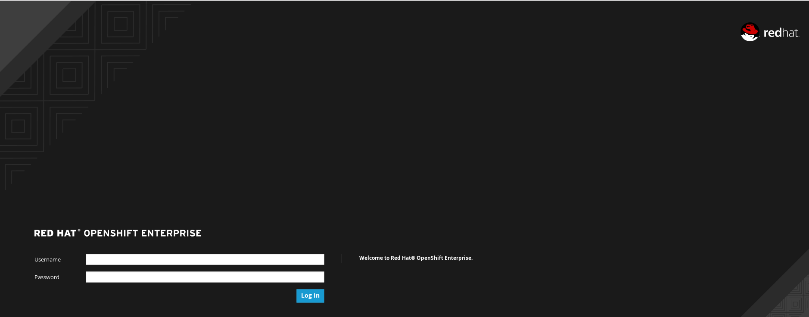  

## CI/CD Tools

The CI/CD tools will be installed in a specific namespace. The first step will be create this namespace with the 
_openshift-dev_ user:

    [rmarting@rhel7 ~] oc new-project cicd --display-name="Continuous Integration and Continuous Delivery Tools"
    Now using project "cicd" on server "https://10.1.2.2:8443".
    
    You can add applications to this project with the 'new-app' command. For example, try:
    
      $ oc new-app centos/ruby-22-centos7~https://github.com/openshift/ruby-hello-world.git
    
    to build a new hello-world application in Ruby.
    [rmarting@rhel7 ~] oc project cicd
    Now using project "cicd" on server "https://10.1.2.2:8443".

### Nexus

[Nexus][4] is a Maven Repository Manager that will help us to resolve the different artifacts used by the applications. It
is a good point to use a central Nexus Repository to avoid resolve and download the artifacts from external Maven
repositories in each build process. 

Following this [article][5] we will have a local Nexus Maven Repository working in our OpenShift platform.  

    [rmarting@rhel7 ~] oc new-app sonatype/nexus
    --> Found Docker image 7decede (5 months old) from Docker Hub for "sonatype/nexus"
    
      * An image stream will be created as "nexus:latest" that will track this image
      * This image will be deployed in deployment config "nexus"
      * Port 8081/tcp will be load balanced by service "nexus"
        * Other containers can access this service through the hostname "nexus"
      * This image declares volumes and will default to use non-persistent, host-local storage.
        You can add persistent volumes later by running 'volume dc/nexus --add ...'
      
    --> Creating resources with label app=nexus ...
      imagestream "nexus" created
      deploymentconfig "nexus" created
      service "nexus" created
    --> Success
    Run 'oc status' to view your app.

*NOTE:* The first time will take some minutes to download and deploy the Nexus images, services and pods. Be patient. 

After that we create a route to access externally to the new service.

    [rmarting@rhel7 ~] oc expose svc/nexus
    route "nexus" exposed

The first image will not include any persistence volume, so any change done in Nexus will be lost after any restart process. 
To avoid it we will create a persistence volumen.

    [rmarting@rhel7 ~/Workspaces/FIS/fis-demo] oc volumes dc/nexus --add --name 'nexus-volume-1' --type 'pvc' --mount-path '/sonatype-work/' --claim-name 'nexus-pv' --claim-size '1G' --overwrite
    persistentvolumeclaims/nexus-pv
    deploymentconfigs/nexus

This change will deploy a new pod with the changes. After some minutes we could access to the Nexus Maven Repository and
do the changes needed for our demo.

We will add some external repositories needed for the applications. Login in [Nexus Maven Repository][6] with 
the Nexus admin user (admin/admin123) and navigate to _Repositories_ section and add the following proxy repositories:
 
* Repository ID: fusesource.m2
* Repository Name: FuseSource Community Release Repository
* Remote Storage Location: https://repo.fusesource.com/nexus/content/groups/public

* Repository ID: fusesource.ea
* Repository Name: FuseSource Community Early Access Release Repository
* Remote Storage Location: https://repo.fusesource.com/nexus/content/groups/ea

* Repository ID: redhat.ga
* Repository Name: Red Hat General Availability Repository
* Remote Storage Location: https://maven.repository.redhat.com/ga

The following screenshoot in Nexus will appear:

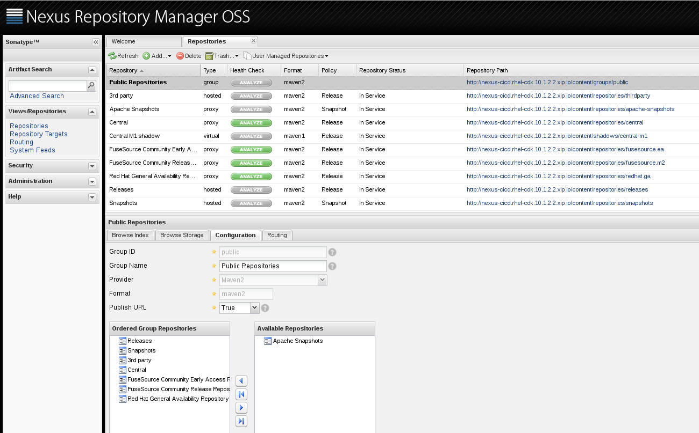

### Jenkins (TODO)

TBC

## xPaaS Images

This demo will use the following xPaaS images:

* xPaaS Images: OpenShift application templates supporting JBoss Middleware based applications. Available from this
[GitHub Repo - jboss-openshift][7]
* Fuse Integration Service Images: Application Templates for Fuse Integration Services. Available from this
[GitHub Repo - jboss-fuse][8]

First at all we need to install these images into _openshift_ namespace to be available for other projects. Using the
_admin_ user we create the A-MQ and FIS templates and images needed:

    [rmarting@rhel7 ~] oc create -n openshift -f https://raw.githubusercontent.com/jboss-openshift/application-templates/master/amq/amq62-basic.json
    template "amq62-basic" created
    [rmarting@rhel7 ~] oc create -n openshift -f https://raw.githubusercontent.com/jboss-openshift/application-templates/master/amq/amq62-persistent-ssl.json
    template "amq62-persistent-ssl" created
    [rmarting@rhel7 ~] oc create -n openshift -f https://raw.githubusercontent.com/jboss-openshift/application-templates/master/amq/amq62-persistent.json
    template "amq62-persistent" created
    [rmarting@rhel7 ~] oc create -n openshift -f https://raw.githubusercontent.com/jboss-openshift/application-templates/master/amq/amq62-ssl.json
    template "amq62-ssl" created
    [rmarting@rhel7 ~] oc create -n openshift -f https://raw.githubusercontent.com/jboss-fuse/application-templates/master/fis-image-streams.json
    imagestream "fis-java-openshift" created
    imagestream "fis-karaf-openshift" created

We could check the images and templates created with the following commands:

    [rmarting@rhel7 ~] oc get is
    NAME                                  DOCKER REPO                                                                    TAGS                               UPDATED
    fis-java-openshift                    registry.access.redhat.com/jboss-fuse-6/fis-java-openshift                     1.0-12,latest,1.0 + 2 more...      6 hours ago
    fis-karaf-openshift                   registry.access.redhat.com/jboss-fuse-6/fis-karaf-openshift                    1.0-11,1.0-12,latest + 2 more...   6 hours ago
    jboss-amq-62                          registry.access.redhat.com/jboss-amq-6/amq62-openshift                         1.1,1.1-2,1.2 + 2 more...          14 hours ago
    jboss-datagrid65-openshift            registry.access.redhat.com/jboss-datagrid-6/datagrid65-openshift               1.2,1.2-13,1.2-18 + 2 more...      14 hours ago
    jboss-decisionserver62-openshift      registry.access.redhat.com/jboss-decisionserver-6/decisionserver62-openshift   1.2-18,latest,1.2 + 2 more...      14 hours ago
    jboss-eap64-openshift                 registry.access.redhat.com/jboss-eap-6/eap64-openshift                         1.4,latest,1.1 + 2 more...         14 hours ago
    jboss-webserver30-tomcat7-openshift   registry.access.redhat.com/jboss-webserver-3/webserver30-tomcat7-openshift     1.2,latest,1.1 + 2 more...         15 hours ago
    jboss-webserver30-tomcat8-openshift   registry.access.redhat.com/jboss-webserver-3/webserver30-tomcat8-openshift     1.2,latest,1.1 + 2 more...         15 hours ago
    jenkins                               172.30.113.241:5000/openshift/jenkins                                          1,latest                           15 hours ago
    mongodb                               172.30.113.241:5000/openshift/mongodb                                          2.4,2.6,latest                     15 hours ago
    mysql                                 172.30.113.241:5000/openshift/mysql                                            5.5,5.6,latest                     15 hours ago
    nodejs                                172.30.113.241:5000/openshift/nodejs                                           0.10,latest                        15 hours ago
    perl                                  172.30.113.241:5000/openshift/perl                                             latest,5.16,5.20                   15 hours ago
    php                                   172.30.113.241:5000/openshift/php                                              5.5,5.6,latest                     15 hours ago
    postgresql                            172.30.113.241:5000/openshift/postgresql                                       9.2,9.4,latest                     15 hours ago
    python                                172.30.113.241:5000/openshift/python                                           2.7,3.3,3.4 + 1 more...            15 hours ago
    ruby                                  172.30.113.241:5000/openshift/ruby                                             2.0,2.2,latest                     15 hours ago
    wildfly                               172.30.113.241:5000/openshift/wildfly                                          10.0,8.1,9.0 + 1 more...           14 hours ago
    [rmarting@rhel7 ~] oc get template
    NAME                                 DESCRIPTION                                                                        PARAMETERS      OBJECTS
    amq62-basic                          Application template for JBoss A-MQ brokers. These can be deployed as standal...   10 (3 blank)    5
    amq62-persistent                     Application template for JBoss A-MQ brokers. These can be deployed as standal...   12 (3 blank)    6
    amq62-persistent-ssl                 Application template for JBoss A-MQ brokers. These are deployed as standalone...   17 (5 blank)    10
    amq62-ssl                            Application template for JBoss A-MQ brokers. These can be deployed as standal...   15 (5 blank)    9
    cakephp-example                      An example CakePHP application with no database                                    15 (8 blank)    5
    cakephp-mysql-example                An example CakePHP application with a MySQL database                               16 (3 blank)    7
    eap64-basic-s2i                      Application template for EAP 6 applications built using S2I.                       12 (3 blank)    5
    eap64-mysql-persistent-s2i           Application template for EAP 6 MySQL applications with persistent storage bui...   34 (16 blank)   10
    jws30-tomcat7-mysql-persistent-s2i   Application template for JWS MySQL applications with persistent storage built...   28 (11 blank)   10
    nodejs-example                       An example Node.js application with no database                                    12 (8 blank)    5
    nodejs-mongodb-example               An example Node.js application with a MongoDB database                             13 (3 blank)    7

For more information about xPaaS images, please, refer [here][9]

# Fuse Integration Services Demo

This section describe the steps needed to install the Integration Services in our OpenShift platform. These services
will be managed under a new project. With the _openshift-dev_ user we create the new project:

    [rmarting@rhel7 ~] oc new-project fis --display-name="Fuse Integration Services Demo"
    Now using project "fis" on server "https://10.1.2.2:8443".
    
    You can add applications to this project with the 'new-app' command. For example, try:
    
      $ oc new-app centos/ruby-22-centos7~https://github.com/openshift/ruby-hello-world.git
    
    to build a new hello-world application in Ruby.

## A-MQ Service

This demo uses some queues to manage some routes. It is needed to deploy a A-MQ service to be used by the different
components. This A-MQ Service will be used locally|internally in the OpenShift platform, so the _amq62-basic_ template is 
the right one.

The _amq62-xxx_ templates created before are available as:

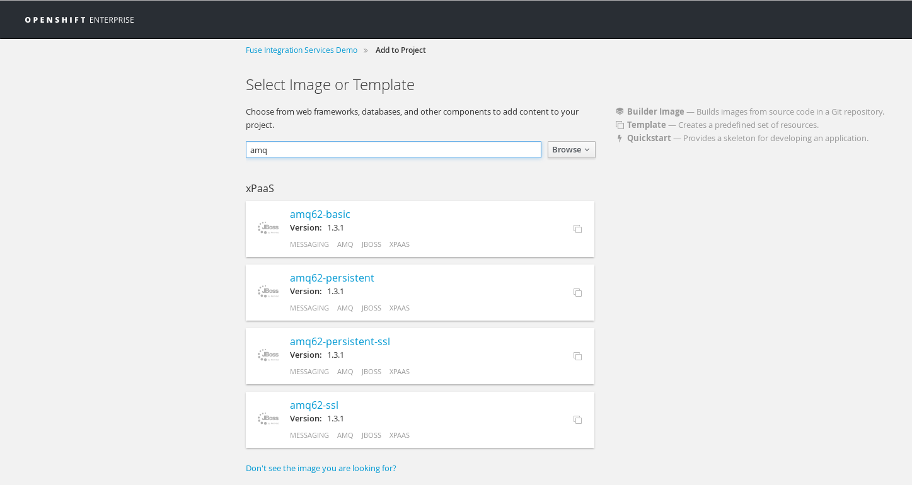

Using the _Web Console UI_ we add a new application using the _amq62-basi_ template with the following parameters: 

* APPLICATION_NAME: amqbroker
* MQ_USERNAME: admin
* MQ_PASSWORD: admin

After some minutes we will have the different AMQ services running:

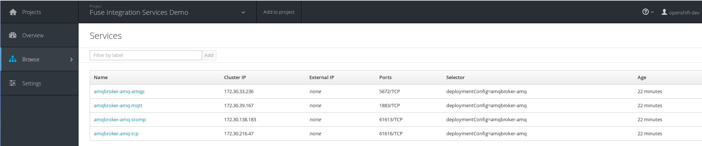

For more information about A-MQ images, please, refer [here][10]

## Demo Services

The Integration Services are based using the following concepts:

* Java Containers:
* Spring Framework:

There are two application templates defined to create the different applications used in this demo. The application
templates will facilitate us the creation process and they will create all the different OpenShift objects needed (build 
config, deployment, service, image stream)

* *fis-demo-web-template*: Template to create a Service exposing services in HTTP ports. 
* *fis-demo-camel-template*: Template to create Service without external HTTP ports.

Logged as _openshift-dev_ user into the _fis_ project, we will create this application templates with:

    [rmarting@rhel7 ~] oc create -f fis-demo-camel-template.json
    template "fis-demo-template-camel" created
    [rmarting@rhel7 ~] oc create -f fis-demo-web-template.json
    template "fis-demo-template-web" created

After that the following templates will be avaible when we add a new application:

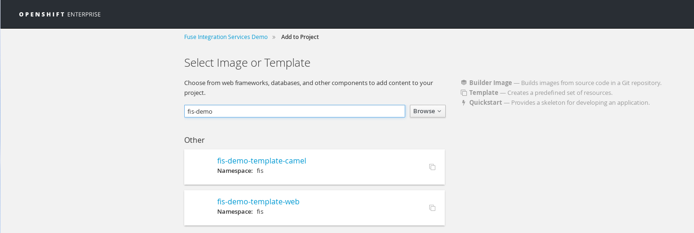

### camel-amq - A-MQ Routes
This application will deploy some routes to produce/consume some messages from the A-MQ broker.

Create a new application using the _fis-demo-template-camel_ template with the following parameters:

* APP_NAME: fis-demo-camel-amq
* GIT_REPO: https://github.com/rmarting/fis-demo/
* CONTEXT_DIR: camel-amq
* SERVICE_NAME: fis-demo-camel-amq

After some minutes we will have the following service running in one pod:

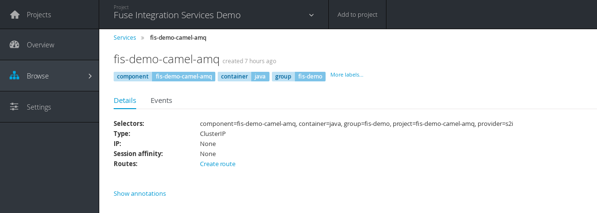
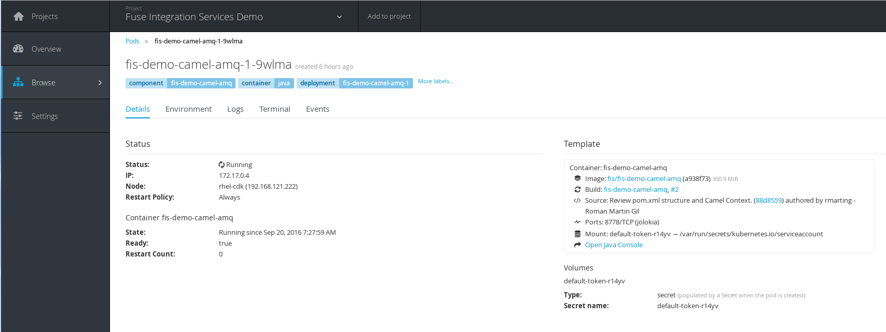

### camel-cxf - SOAP Web Service
This application will deploy some routes to expose some SOAP Web Services.

Create a new application using the _fis-demo-template-web_ template with the following parameters:

* APP_NAME: fis-demo-camel-cxf
* GIT_REPO: https://github.com/rmarting/fis-demo/
* CONTEXT_DIR: camel-cxf
* SERVICE_NAME: fis-demo-camel-cxf

After the application is deployed we will create a route:

    [rmarting@rhel7 ~] oc expose svc/fis-demo-camel-cxf
    route "fis-demo-camel-cxf" exposed

After some minutes we will have the following service running in one pod:

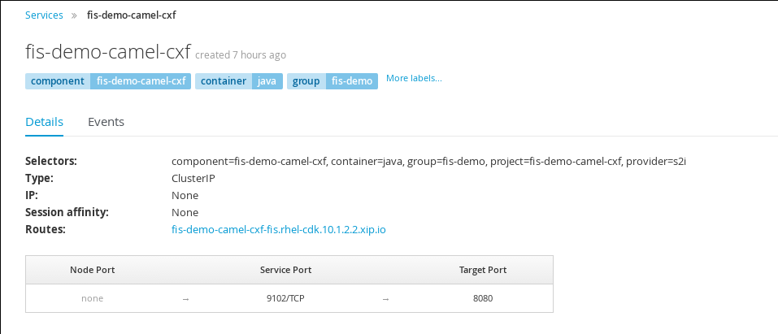
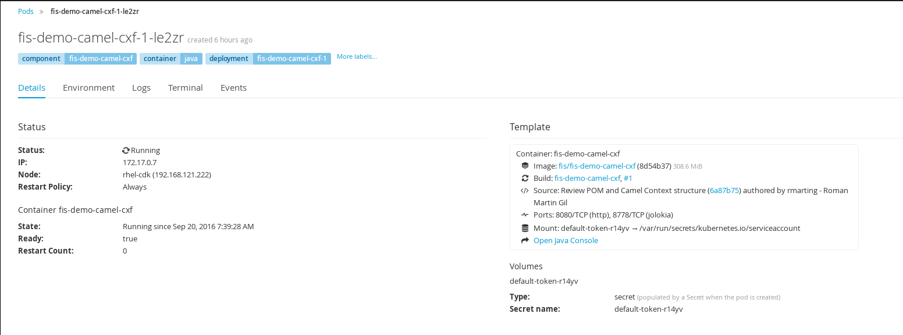

If there is not issues, the WSDL will be available at:

    http://fis-demo-camel-cxf-fis.rhel-cdk.10.1.2.2.xip.io/ws/customer/?wsdl

There is a SoapUI project create in _camel-cxf/src/test/resources/soapui_ with a sample request to test the Web
Service deployed in the platform.

### camel-cxfrs - REST Service
This application will deploy some routes to produce/consume some messages from the A-MQ broker.

Create a new application using the _fis-demo-template-web_ template with the following parameters:

* APP_NAME: fis-demo-camel-cxfrs
* GIT_REPO: https://github.com/rmarting/fis-demo/
* CONTEXT_DIR: camel-cxfrs
* SERVICE_NAME: fis-demo-camel-cxfrs

After the application is deployed we will create a route:

    [rmarting@rhel7 ~] oc expose svc/fis-demo-camel-cxfrs
    route "fis-demo-camel-cxfrs" exposed

After some minutes we will have the following service running in one pod:

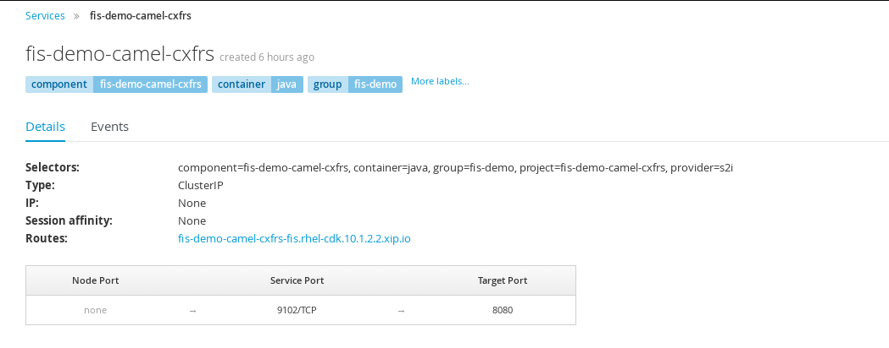
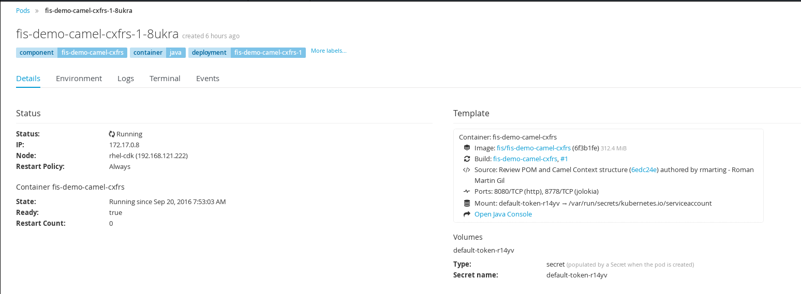

If there is not issues, we could test the REST endpoint with the following _curl_ command:

    [rmarting@rhel7 ~] curl -H "Accept: application/json" -H "Content-Type: application/json" -X POST \
    > -d '{"company":{"name":"MicroservicesVision","geo":"WA","active":true},"contact":{"firstName":"Fred","lastName":"Quicksand","streetAddr":"202 Barney Blvd.","city":"Rock City","state":"MI","zip":"19728","phone":"100-400-2000"},"clientId":0,"salesRepresentative":null}' \
    > http://fis-demo-camel-cxfrs-fis.rhel-cdk.10.1.2.2.xip.io/rs/customerservice/enrich
    {"company":{"name":"MicroservicesVision","geo":"WEST_AMERICA","active":true},"contact":{"firstName":"Fred","lastName":"Quicksand","streetAddr":"202 Barney Blvd.","city":"Rock City","state":"MI","zip":"19728","phone":"100-400-2000"},"clientId":0,"salesRepresentative":null}

### camel-eip - Enterprise Integration Patterns
This application will deploy some routes to integrate different resources (a-mq, web services, files, ...).

Create a new application using the _fis-demo-template-camel_ template with the following parameters:

* APP_NAME: fis-demo-camel-eip
* GIT_REPO: https://github.com/rmarting/fis-demo/
* CONTEXT_DIR: camel-eip
* SERVICE_NAME: fis-demo-camel-eip

After some minutes we will have the following service running in one pod:

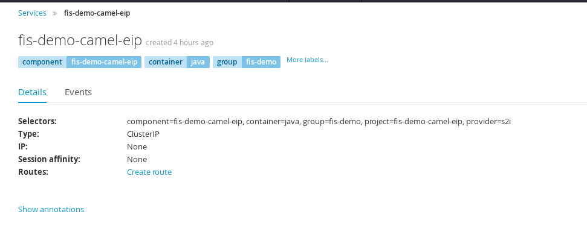
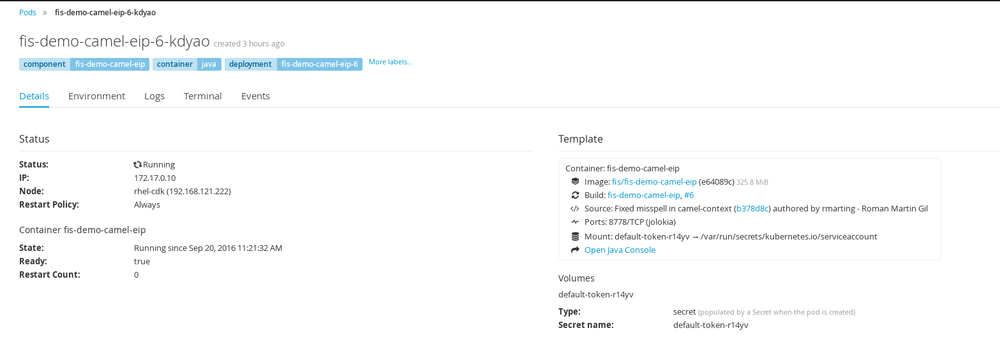

# Testing Integration Services

Follow the next steps to test all services deployed in OpenShift:

* Access to the Java Console in the A-MQ pod. From that console we will send a message (CSV format) to _customer-csv_ queue.

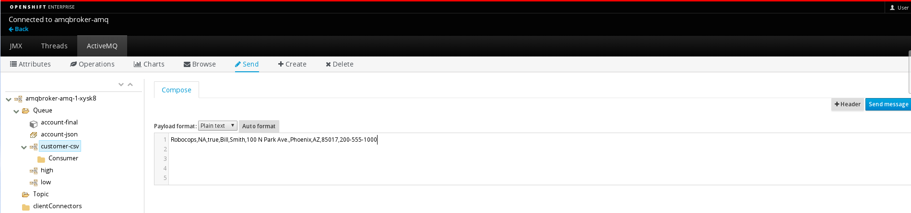

There is a csv-file in camel-eip/src/data/inbox folder with some sample data:  

    Robocops,NA,true,Bill,Smith,100 N Park Ave.,Phoenix,AZ,85017,200-555-1000

The Integration routes will manage this data, enrich with some extra information from the external web services and
finally store a new message into _account-final_ queue. If there is not any issue, browsing that queue we could check
a new message with the right new data:

    {"company":{"name":"Robocops","geo":"NORTH_AMERICA","active":true},"contact":{"firstName":"Bill","lastName":"Smith","streetAddr":"100 N Park Ave.","city":"Phoenix","state":"AZ","zip":"85017","phone":"200-555-1000"},"clientId":88,"salesRepresentative":"James Strachan"}

A sample screenshoot:

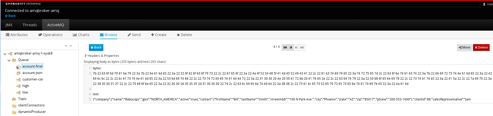

Also it is possible review the log messages in camel-eip pod. Similar log messages will be showed:

    2016-09-20 08:14:14,502 [r[customer-csv]] INFO  load-customer-amq              - (AMQ) Customer: org.acme.Customer@29ce456a
    2016-09-20 08:14:14,506 [r[customer-csv]] INFO  load-customer-amq              - (AMQ) Account: {"company":{"name":"Robocops","geo":"NA","active":true},"contact":{"firstName":"Bill","lastName":"Smith","streetAddr":"100 N Park Ave.","city":"Phoenix","state":"AZ","zip":"85017","phone":"200-555-1000"},"clientId":0,"salesRepresentative":null}
    2016-09-20 08:14:14,515 [r[account-json]] INFO  load-account-amq               - (AMQ) Account JSON: {"company":{"name":"Robocops","geo":"NA","active":true},"contact":{"firstName":"Bill","lastName":"Smith","streetAddr":"100 N Park Ave.","city":"Phoenix","state":"AZ","zip":"85017","phone":"200-555-1000"},"clientId":0,"salesRepresentative":null}
    2016-09-20 08:14:14,518 [r[account-json]] INFO  load-account-amq               - (AMQ) Account POJO: Account [company=Company [name=Robocops, geo=NA, active=true], contact=Contact [firstName=Bill, lastName=Smith, streetAddr=100 N Park Ave., city=Phoenix, state=AZ, zip=85017, phone=200-555-1000], clientId=0, salesRepresentative=null]
    2016-09-20 08:14:14,518 [r[account-json]] INFO  processAccount                 - Processing Account: Account [company=Company [name=Robocops, geo=NA, active=true], contact=Contact [firstName=Bill, lastName=Smith, streetAddr=100 N Park Ave., city=Phoenix, state=AZ, zip=85017, phone=200-555-1000], clientId=0, salesRepresentative=null]
    2016-09-20 08:14:14,519 [r[account-json]] INFO  callRS                         - Invoking REST Service:
    Account [company=Company [name=Robocops, geo=NA, active=true], contact=Contact [firstName=Bill, lastName=Smith, streetAddr=100 N Park Ave., city=Phoenix, state=AZ, zip=85017, phone=200-555-1000], clientId=0, salesRepresentative=null]
    2016-09-20 08:14:14,780 [r[account-json]] INFO  callRS                         - Response from REST Service:
    Account [company=Company [name=Robocops, geo=NORTH_AMERICA, active=true], contact=Contact [firstName=Bill, lastName=Smith, streetAddr=100 N Park Ave., city=Phoenix, state=AZ, zip=85017, phone=200-555-1000], clientId=0, salesRepresentative=null]
    2016-09-20 08:14:14,780 [r[account-json]] INFO  HelperProcessor                - Account from CustomerRS: Account [company=Company [name=Robocops, geo=NORTH_AMERICA, active=true], contact=Contact [firstName=Bill, lastName=Smith, streetAddr=100 N Park Ave., city=Phoenix, state=AZ, zip=85017, phone=200-555-1000], clientId=0, salesRepresentative=null]
    2016-09-20 08:14:14,788 [r[account-json]] INFO  callRS                         - Response from customerRestServiceClient:
    Account [company=Company [name=Robocops, geo=NORTH_AMERICA, active=true], contact=Contact [firstName=Bill, lastName=Smith, streetAddr=100 N Park Ave., city=Phoenix, state=AZ, zip=85017, phone=200-555-1000], clientId=0, salesRepresentative=null]
    2016-09-20 08:14:14,791 [r[account-json]] INFO  callWS                         - Invoking SOAP-WS Service:
    Account [company=Company [name=Robocops, geo=NA, active=true], contact=Contact [firstName=Bill, lastName=Smith, streetAddr=100 N Park Ave., city=Phoenix, state=AZ, zip=85017, phone=200-555-1000], clientId=0, salesRepresentative=null]
    2016-09-20 08:14:15,073 [r[account-json]] INFO  callWS                         - Response from SOAP-WS:
    CorporateAccount [company=Company [name=Robocops, geo=NA, active=true], contact=Contact [firstName=Bill, lastName=Smith, streetAddr=100 N Park Ave., city=Phoenix, state=AZ, zip=85017, phone=200-555-1000], id=88, salesContact=James Strachan]
    2016-09-20 08:14:15,073 [r[account-json]] INFO  AccountAggregator              - Account data updated. Account [company=Company [name=Robocops, geo=NORTH_AMERICA, active=true], contact=Contact [firstName=Bill, lastName=Smith, streetAddr=100 N Park Ave., city=Phoenix, state=AZ, zip=85017, phone=200-555-1000], clientId=88, salesRepresentative=James Strachan]
    2016-09-20 08:14:15,073 [r[account-json]] INFO  processAccount                 - Aggregate Result: Account [company=Company [name=Robocops, geo=NORTH_AMERICA, active=true], contact=Contact [firstName=Bill, lastName=Smith, streetAddr=100 N Park Ave., city=Phoenix, state=AZ, zip=85017, phone=200-555-1000], clientId=88, salesRepresentative=James Strachan]

If we access to the Java Console of the camel-eip pod we could review the Camel execution statistics: 

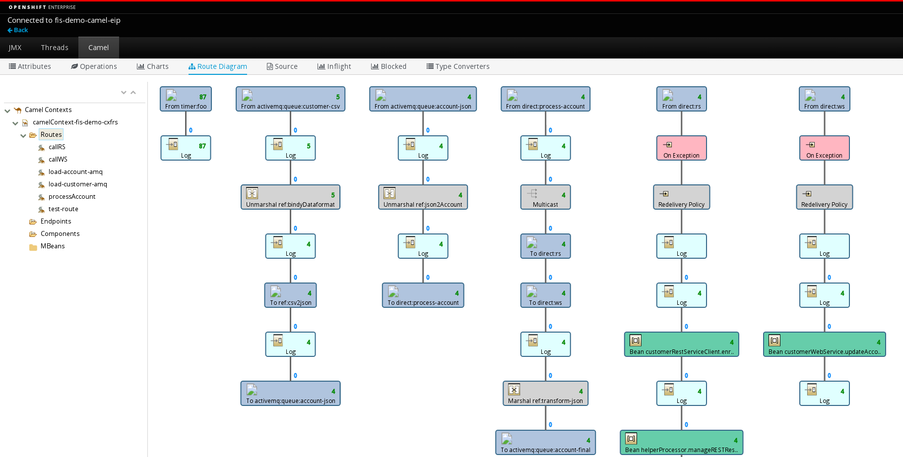

<!-- References and Links -->

[1]: https://access.redhat.com/documentation/en/red-hat-xpaas/version-0/red-hat-xpaas-fuse-integration-services-image/
[2]: https://access.redhat.com/documentation/en/red-hat-container-development-kit/
[3]: https://access.redhat.com/documentation/en/red-hat-container-development-kit/2.1/single/installation-guide/
[4]: http://www.sonatype.org/nexus/
[5]: https://docs.openshift.org/latest/dev_guide/app_tutorials/maven_tutorial.html
[6]: http://nexus-cicd.rhel-cdk.10.1.2.2.xip.io/#welcome
[7]: https://github.com/jboss-openshift/application-templates
[8]: https://github.com/jboss-fuse/application-templates
[9]: https://docs.openshift.org/latest/install_config/imagestreams_templates.html#install-config-imagestreams-templates
[10]: https://access.redhat.com/documentation/en/red-hat-xpaas/0/paged/red-hat-xpaas-a-mq-image/chapter-5-tutorials

# Other Resources

* [Technical Restrictions on Fuse Integration Services](https://access.redhat.com/articles/2112371)
* [How to use local Nexus mirror for EAP s2i in OpenShift](https://access.redhat.com/solutions/2293571)
* [CI/CD with OpenShift](https://blog.openshift.com/cicd-with-openshift)
* [CXFRS Component](http://camel.apache.org/cxfrs.html)
* [Configuring JAX-RS Client Endpoints](https://access.redhat.com/documentation/en-US/Red_Hat_JBoss_Fuse/6.2/html/Apache_CXF_Development_Guide/JAXRSEndpointConfig-CltConfig.html)
* [Implementing a CXFRS client in JBoss Fuse](http://www.rubix.nl/blogs/implementing-cxfrs-client-jboss-fuse)
